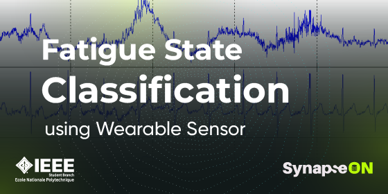

## This project is my solution to the first task of the SynapseON II Datathon, organized by the IEEE Student Branch of the Higher Polytechnic School (ENP Algiers).

  

# 💤 Fatigue State Classifier

This project builds a machine learning classifier to detect whether a person is in a rest or fatigue state based on physiological signals (e.g., heart rate, EMG, IR).

## This notebook demonstrates:

-Loading and preprocessing biosignal data

-Feature selection and normalization

-Training machine learning classifiers

-Evaluating model performance

# Dataset Contains columns such as:

IR → Infrared sensor readings

bpm / avgBPM → Heart rate and average beats per minute

EMG → Electromyography signal

state → Target variable (Rest / Fatigue)

## 📊 Example Use Cases

- Detect fatigue in drivers to prevent accidents

- Monitor athlete fatigue during training

- Early health monitoring in medical applications

# Tech Stack

* Python

* pandas / NumPy → data handling

* matplotlib / seaborn → data visualization

* scikit-learn → ML models and evaluation
